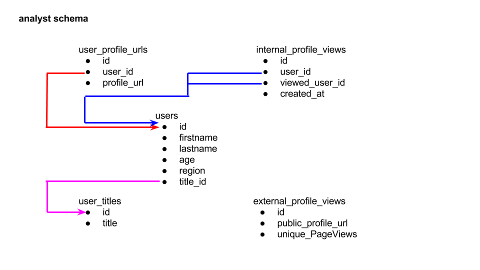

# Doximity data analyst technical challenge
#### Proprietary and Confidential

## Challenge Scenario
Consider a scenario where you work for a social network company for academics. This social network includes full professors, assistant professors, postdoctoral students, graduate students and others as members. To increase engagement and interaction among the members of this academic community, your product manager wants to roll out a feature that ranks members in the network according to the number of times other people have viewed their social profiles. The product manager sketches out a general vision for the product, which would appear differently for each user:

__________

*Your rank for profile views*

1. Jane Doe
2. John Doe
3. You
4. Jon Doe
5. Jan Doe
6. ...

__________

Working as the data team’s point person on this project, you are responsible for pulling together and manipulating relevant data to advise the product manager on how the data can drive this new feature forward. Central to these tasks are the tables in your company’s database that contain user information and profile view records. To help you familiarize yourself with where the data live, here's a visual and explanation of the table schema:

Briefly,
- *users:* table containing information about the members of the academic network
- *user_titles:* table containing job titles; foreign key in users is title_id (magenta)
- *user_profile_urls:* tabulates user_id and its associated profile url used internally
- *internal_profile_views:* tabulates all profile views that occurred within the social network application; logged as user_id who views the profile of viewed_user_id
- *external_profile_views:* tabulates summary information about clicks on public_profile_urls that occur off of search engine searches

__________

## Instructions for connecting to the database

We recommend installing a MySQL application to help you connect to our interview database (options are contingent on your operating system, and while we propose the two applications below, you can feel free to use alternative methods of your choosing):

-- (If Mac) http://www.sequelpro.com/download

Once downloaded and installed, you can connect to our database by opening a connection window and providing the following details for a "Standard" connection:

- host: 34.196.124.246
- user: candidate
- password: Doximity
- port: 3316

-- (If PC) http://dev.mysql.com/downloads/workbench/

Similarly, opening a connection window and providing the above information.

__________

## Part I

The product manager has some questions on the data and is looking to you for some insight. Please provide your answer (and any applicable SQL queries you used to arrive at the answer):

1. What is the average age of users by region?
2. Could you provide a breakdown of user title and number of user counts associated with each title?
3. Who is the top viewed user, based on internal profile views?
4. Can you provide a ranked list of the top 10 most viewed users based on internal profile views, supplemented with data from the user table?
5. Which region gets the most viewed users (based on internal profile views)?

__________

## Part II

With these data, your goals are to understand and help the product manager understand how users are interacting with each others’ profiles, to understand how much web traffic user profiles are receiving and from where, to pull the data in a form that can generate a “Rank for profile views” feature, and to postulate how the data may best be presented in this product.

To this end, you should create one or two data visualizations to help the product manager understand the social network’s profile views data and write a brief summary communicating how the data may be used to drive the product forward.
__________

## Summary of expectations
This problem is very open-ended, so feel free to investigate questions of your own that may help address the needs of the product/product manager. Below are two guideline questions that you may use for starters:

1. What is the most interesting insight or opportunity that you discovered?
2. What possible improvements to the data would you like to make?

** We suggest you spend no more than five hours to complete this challenge. It's likely you won't have time to include everything you wanted (or perhaps even answer all questions in the challenge), and that's ok.  Please submit all the code you wrote, your data visualizations (we love Jupyter notebooks, but feel free to submit in other formats, e.g. Word docs), and answers to the questions via email (instructions below). We hope this exercise is helpful (maybe even fun!) for you and appreciate your taking the time to do it! **

------------

## Submission instructions

1. Provide your Doximity point of contact with your GitLab username (create a new account if you do not already have one). Your point of contact will add you to the data challenge repository. Once you've been added to the repo, you should see in the Project tab the `data-analytics` project containing the challenge instructions.
2. Fork the `data-analytics` repository.
3. In the `data-analytics` project tab, click on `Members`. Under `Project members`, click on the `Add member` tab. Under `Select members to invite`, please type in `Doximity-data` and choose the `Developer` role permission. When done, click `Add to project`. This will enable us to review your challenge submission (turned in as a `Merge Request`) when complete.
4. In the forked `data-analytics` project, create a new branch `lastname-firstname`. Work on the assignment and commit your changes to the `lastname-firstname` branch.
5. When complete with the assignment, after having commit all your changes, create a new `Merge Request`. Add `Doximity-data` as an assignee, so we are notified you have submit the `Merge Request`. We will then review your submission and get back to you.

* For a visual walk-through of the submission process, please watch [this video](https://vimeo.com/227828054/562c3f6acf). 
* If any questions come up, please send an email to your Doximity point of contact.